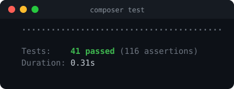
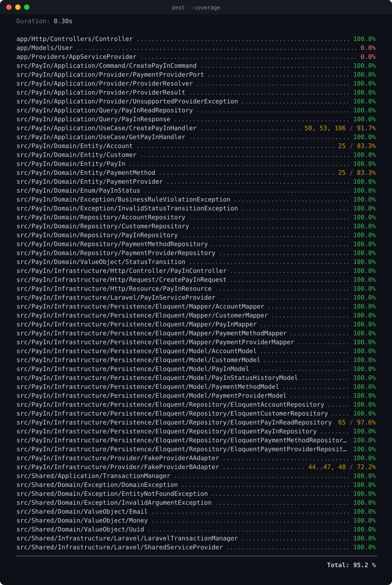

# PayIn Platform

Componente reusable para el procesamiento de transacciones **PayIn**, construido con **Arquitectura Hexagonal** sobre **Laravel 13** y **PHP 8.4+**. Soporta múltiples proveedores de pago mediante adaptadores desacoplados y mantiene el dominio independiente del framework.

## Estructura del repositorio

```
.
├── docs/
│   ├── PRD.md                 # Product Requirements Document
│   ├── ADR.md                 # Architecture Decision Records (ADR-001..011)
│   ├── schema.sql             # Script SQL del modelo normalizado (dump)
│   ├── openapi.json           # Spec OpenAPI 3.1 (Scramble)
│   ├── tests.svg              # Salida real de la suite (Pest)
│   ├── coverage.svg           # Salida real de la cobertura (Pest)
│   ├── postman/               # Colección Postman
│   └── diagrams/              # Diagramas en Markdown (Mermaid)
│       ├── architecture.md
│       ├── sequence.md
│       ├── er.md
│       └── domain.md
├── backend/                   # Aplicación Laravel (API REST v1)
│   ├── src/                   # Código hexagonal (namespace Src\)
│   └── Dockerfile             # Imagen del backend (multi-stage)
├── docker-compose.yml         # Stack: MariaDB + API
├── run.sh                     # Lanzador de un comando (build + up)
├── DOCKER.md                  # Guía de Docker
├── .env.example               # Variables de orquestación (Compose)
├── .github/workflows/ci.yml   # Pipeline CI (Pint · PHPStan · Pest)
└── README.md
```

## Arquitectura

Arquitectura Hexagonal (Ports & Adapters). El dominio **no** depende de Laravel ni de infraestructura; la comunicación con el exterior pasa por puertos (interfaces) y adaptadores. Ver [`docs/ADR.md`](docs/ADR.md).

```
backend/src/
├── PayIn/
│   ├── Domain/               # Entidades, VOs, enum de estados, puertos de repositorio
│   │   ├── Entity/           #   PayIn (aggregate root), Customer, Account, ...
│   │   ├── Enum/             #   PayInStatus (+ transiciones válidas)
│   │   ├── Factory/          #   PayInFactory (ensamblado del agregado)
│   │   ├── ValueObject/      #   StatusTransition
│   │   ├── Repository/       #   Puertos (interfaces)
│   │   └── Exception/
│   ├── Application/          # Casos de uso, comandos, DTOs de lectura, ProviderResolver
│   │   ├── UseCase/          #   CreatePayInHandler, ProcessPayInHandler, GetPayInHandler
│   │   ├── Command/ Query/   #   CreatePayInCommand, PayInResponse, puerto de lectura
│   │   └── Provider/         #   PaymentProviderPort, ProviderResolver, ProviderResult
│   ├── Infrastructure/       # Adaptadores concretos
│   │   ├── Http/             #   Controller, FormRequest, Resource
│   │   ├── Persistence/      #   Modelos Eloquent, repositorios, mappers, Migrations/
│   │   ├── Provider/         #   Adaptadores de proveedor (simulados)
│   │   └── Laravel/          #   PayInServiceProvider, ProcessPayInJob (cola)
│   └── Tests/                # Pruebas del módulo (Unit/ y Feature/)
├── Shared/                   # VOs reutilizables (Money, Email, Uuid), excepciones, TransactionManager
│   ├── Infrastructure/
│   │   ├── Persistence/      #   Migrations/ de tablas de infraestructura (sessions, cache, jobs)
│   │   └── Laravel/          #   SharedServiceProvider, LaravelTransactionManager
│   └── Tests/                # TestCase base + pruebas de los VOs compartidos
└── composer.json             # `revolutiva/payin`: paquete Composer del módulo
```

**`src/` es un paquete Composer independiente** (`revolutiva/payin`), instalado por la app vía repositorio `path` (symlink en `vendor/revolutiva/payin`). Declara sus propias dependencias y registra sus ServiceProviders por *package discovery*, no desde `bootstrap/providers.php`.

**Migraciones y pruebas viven dentro del módulo**, no en `database/migrations` ni en `tests/`: cada módulo registra sus migraciones desde su propio ServiceProvider (`loadMigrationsFrom`). El único archivo de pruebas fuera de `src/` es `backend/tests/Pest.php`, el bootstrap que Pest exige en su directorio por defecto; las pruebas en sí están en `src/<Modulo>/Tests`.

**Sin scaffolding de más:** el componente no incluye frontend, autenticación ni modelo `User` (PRD §3). Se retiraron Vite/Tailwind, las vistas, `routes/web.php` y las tablas `users`/`password_reset_tokens`; queda `sessions` porque el stack de Docker usa `SESSION_DRIVER=database`.

**Procesamiento síncrono, listo para cola:** el paso de proveedor es un caso de uso propio (`ProcessPayInHandler`) que recibe un UUID y recarga el agregado. `CreatePayInHandler` lo llama en línea; `ProcessPayInJob` es el mismo caso de uso despachado a una cola, así que pasar a asíncrono es cambiar una línea ([ADR-004](docs/ADR.md#adr-004---procesamiento-síncrono-con-diseño-listo-para-asíncrono)).

**Regla de dependencias:** `Infrastructure → Application → Domain`. Los VOs comunes viven en `Shared`.

## API

| Método | Endpoint                 | Descripción                        |
| ------ | ------------------------ | ---------------------------------- |
| POST   | `/api/v1/pay-ins`        | Crear una transacción PayIn        |
| GET    | `/api/v1/pay-ins/{uuid}` | Consultar una transacción por UUID |

Todos los campos de request/response usan `snake_case`.

### Ejemplo — crear PayIn

```bash
curl -X POST http://localhost:8000/api/v1/pay-ins \
  -H 'Accept: application/json' -H 'Content-Type: application/json' \
  -d '{
    "customer_uuid": "11111111-1111-4111-8111-111111111111",
    "account_uuid": "22222222-2222-4222-8222-222222222222",
    "payment_method_uuid": "33333333-3333-4333-8333-333333333333",
    "provider_code": "provider_a",
    "amount": 15000,
    "currency": "USD"
  }'
```

```jsonc
// 201 Created
{
  "data": {
    "uuid": "…",
    "customer_uuid": "11111111-…",
    "account_uuid": "22222222-…",
    "payment_method_uuid": "33333333-…",
    "provider_code": "provider_a",
    "amount": 15000,
    "currency": "USD",
    "status": "PROCESSED",
    "provider_request":  { "…": "…" },
    "provider_response": { "status": "approved", "…": "…" },
    "created_at": "2026-08-04T…",
    "updated_at": "2026-08-04T…"
  }
}
```

Los UUID de ejemplo provienen del `PayInReferenceSeeder`. El adaptador `provider_b` **rechaza** importes por encima de un límite simulado (`> 1000000`), dejando la transacción en estado `FAILED`.

### Códigos de respuesta

| Código | Situación                                                        |
| ------ | ---------------------------------------------------------------- |
| 201    | PayIn creado (estado final `PROCESSED` o `FAILED`)               |
| 200    | Consulta correcta                                                |
| 404    | Customer/Account/PaymentMethod/Provider o PayIn no encontrado    |
| 422    | Error de validación o violación de regla de negocio              |

## Estados de una transacción

`CREATED → VALIDATED → PROCESSED`, con `FAILED` como estado terminal de error. Cada transición se registra en `pay_in_status_history` (ver [ADR-007](docs/ADR.md#adr-007---máquina-de-estados-de-payin)).

## Puesta en marcha con Docker (recomendado)

Un solo comando construye y levanta el stack (MariaDB + API). Migraciones y
datos de referencia corren automáticamente en el primer arranque.

```bash
./run.sh          # build + up, espera a que la API responda
./run.sh logs     # sigue los logs
./run.sh down     # detiene y elimina los contenedores
```

Una vez arriba:

- **API:** http://localhost:8000/api/v1
- **Documentación de la API (Swagger UI):** http://localhost:8000/docs/api
- **OpenAPI (JSON):** http://localhost:8000/docs/api.json
- **Health check:** http://localhost:8000/up

Detalles y configuración en [`DOCKER.md`](DOCKER.md).

## Puesta en marcha manual (sin Docker)

Requisitos: **PHP 8.4+** y **Composer 2.x**.

```bash
cd backend
cp .env.example .env
php artisan key:generate
php artisan migrate --seed    # crea tablas + datos de referencia
php artisan serve             # http://localhost:8000
```

Por defecto usa SQLite; ajusta las variables `DB_*` en `.env` para otra base.

El esquema relacional se define en las migraciones de cada módulo
(`backend/src/PayIn/Infrastructure/Persistence/Migrations` y
`backend/src/Shared/Infrastructure/Persistence/Migrations`), que son la única
fuente de verdad. El script SQL del modelo normalizado ya está
versionado en [`docs/schema.sql`](docs/schema.sql) (generado con un dump).

## Decisiones arquitectónicas

Resumen — el detalle y la justificación de cada una está en [`docs/ADR.md`](docs/ADR.md):

- **Arquitectura Hexagonal** con el dominio en PHP puro, aislado de Laravel ([ADR-001](docs/ADR.md#adr-001---arquitectura-hexagonal), [ADR-002](docs/ADR.md#adr-002---dominio-desacoplado-de-laravel)).
- **Selección de proveedor** con `ProviderResolver`; incorporar uno nuevo = añadir un adaptador ([ADR-003](docs/ADR.md#adr-003---selección-de-proveedor-mediante-providerresolver)).
- **Persistir antes de enviar al proveedor**: dos escrituras atómicas con la llamada externa entre ambas ([ADR-009](docs/ADR.md#adr-009---operaciones-transaccionales)).
- **Procesamiento síncrono** con diseño listo para migrar a colas ([ADR-004](docs/ADR.md#adr-004---procesamiento-síncrono-con-diseño-listo-para-asíncrono)).
- **Identificadores duales** `id` interno + `uuid` público ([ADR-005](docs/ADR.md#adr-005---identificadores-duales-id-interno--uuid-público)).
- **Auditoría** de request/response del proveedor + historial de estados ([ADR-006](docs/ADR.md#adr-006---auditoría-de-proveedor-e-historial-de-estados)).
- **Máquina de estados** validada en el dominio ([ADR-007](docs/ADR.md#adr-007---máquina-de-estados-de-payin)).
- **API versionada y snake_case** ([ADR-008](docs/ADR.md#adr-008---api-rest-versionada-y-snake_case)).
- **Factory del agregado** para concentrar su ensamblado en el dominio ([ADR-010](docs/ADR.md#adr-010---factory-del-agregado-payin)).
- **El módulo es un paquete Composer**, con sus migraciones y pruebas dentro ([ADR-011](docs/ADR.md#adr-011---el-módulo-es-un-paquete-composer)).

## Patrones de diseño aplicados

| Patrón | Dónde |
| --- | --- |
| Repository | Puertos `*Repository` (Domain) + implementaciones Eloquent (Infrastructure) |
| Strategy | `PaymentProviderPort` — cada adaptador es una estrategia de proveedor |
| Factory | `ProviderResolver` selecciona el adaptador según el código |
| Adapter | `FakeProviderAAdapter` / `FakeProviderBAdapter` (un adaptador ≈ microservicio del proveedor) |
| DTO | `CreatePayInCommand`, `PayInResponse` |
| Value Object | `Money`, `Email`, `Uuid`, `StatusTransition` |
| Dependency Injection | Bindings puerto→adaptador en `PayInServiceProvider` |
| Mapper | `*Mapper` traduce Eloquent ↔ entidades de dominio |

Referencia completa en [PRD §11](docs/PRD.md).

## Integración continua (CI)

Herramienta: **GitHub Actions** ([`.github/workflows/ci.yml`](.github/workflows/ci.yml)). En cada push y pull request corre, en un job:

1. **Pint** (`--test`) — estilo de código (PSR-12).
2. **PHPStan/Larastan** (nivel 6) — análisis estático.
3. **Pest** con cobertura y **gate `--min=80`** (bloquea si baja del 80%).

Modelo: pipeline de validación por PR (lint → análisis estático → pruebas) que impide el merge si algo falla. Es directamente extensible con etapas de build de la imagen Docker y despliegue.

## Calidad del código

Cómo se garantiza y con qué métodos/herramientas:

- **Pruebas** (Pest): unitarias de dominio (PHP puro, sin arrancar el framework) + feature de API y repositorio. Cobertura **96%** (gate del 80% exigido en CI).
- **Análisis estático**: PHPStan/Larastan **nivel 6**.
- **Estilo consistente**: Laravel Pint.
- **Diseño testeable**: dominio desacoplado → pruebas rápidas sin base de datos; puertos fácilmente sustituibles por dobles de prueba.
- **Prácticas**: `declare(strict_types=1)`, Value Objects inmutables, clases `final` por defecto, tipado explícito.
- **CI** como control obligatorio antes del merge.

```bash
cd backend
composer test        # Pest
composer lint        # Laravel Pint (--test)
composer analyse     # PHPStan / Larastan (nivel 6)
composer check       # lint + analyse + test
```



<details>
<summary><b>Cobertura por archivo</b> — <code>pest --coverage</code> (total 96.0%)</summary>



</details>

Ambas imágenes son la salida real de Pest (`composer test` y `pest --coverage`).

## Suposiciones

Detalle en [PRD §16](docs/PRD.md). En resumen: el proveedor se indica en el request; no hay integraciones reales (adaptadores simulados); todas las operaciones son transaccionales; sin reintentos automáticos; sin autenticación ni autorización.

## Riesgos

Detalle en [PRD §17](docs/PRD.md). En resumen: cambios futuros en los contratos de los proveedores; reglas de negocio aún por definir; el procesamiento asíncrono queda fuera de alcance; las integraciones reales requerirían nuevos adaptadores.

## Documentación

- [PRD](docs/PRD.md) — requisitos del producto, suposiciones y riesgos.
- [ADR](docs/ADR.md) — decisiones arquitectónicas (ADR-001..011).
- [Diagramas](docs/diagrams/) — componente/arquitectura, secuencia, ER y dominio.
- [schema.sql](docs/schema.sql) — script SQL del modelo normalizado, generado con un dump del esquema producido por las migraciones (`mariadb-dump --no-data`). Fuente de verdad: las migraciones dentro de `backend/src/*/Infrastructure/Persistence/Migrations`.
- [Postman](docs/postman/) — colección de la API (Collection v2.1, importable directo).
- [OpenAPI](docs/openapi.json) — spec OpenAPI 3.1 generada con [Scramble](https://scramble.dedoc.co/) (`composer openapi`). Con el backend en marcha, Swagger UI en `/docs/api` y el documento en `/docs/api.json`.
