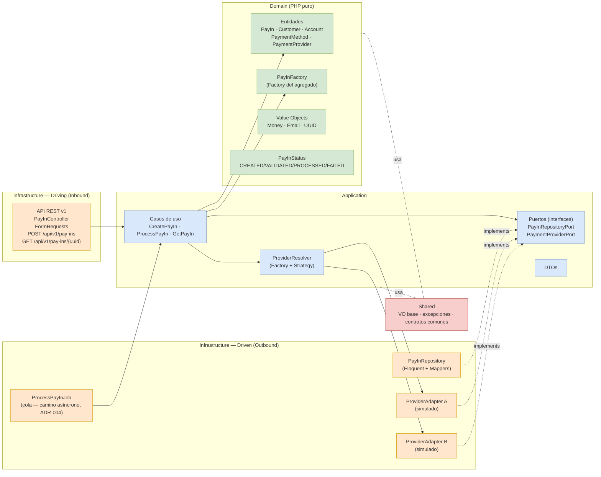

# Diagrama de Arquitectura — Hexagonal (Ports & Adapters)

El dominio no depende de Laravel ni de infraestructura. Los adaptadores de entrada (API) invocan los casos de uso de la capa de Aplicación; los adaptadores de salida (persistencia y proveedores) implementan los puertos definidos por la Aplicación.

**Regla de dependencias:** las flechas de infraestructura apuntan *hacia adentro*. `Infrastructure → Application → Domain`. El dominio no conoce a nadie fuera de sí mismo.

**Empaquetado:** todo lo anterior vive en `backend/src`, que es un paquete Composer (`revolutiva/payin`) con sus migraciones y sus pruebas dentro — ver [ADR-011](../ADR.md#adr-011---el-módulo-es-un-paquete-composer).
