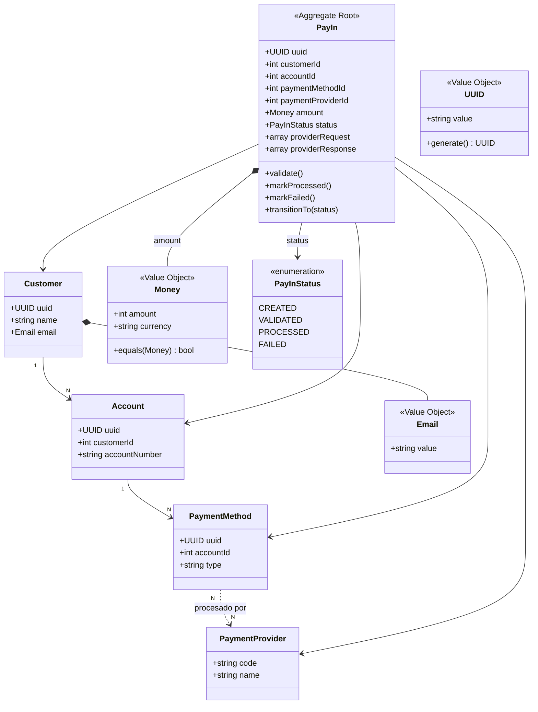
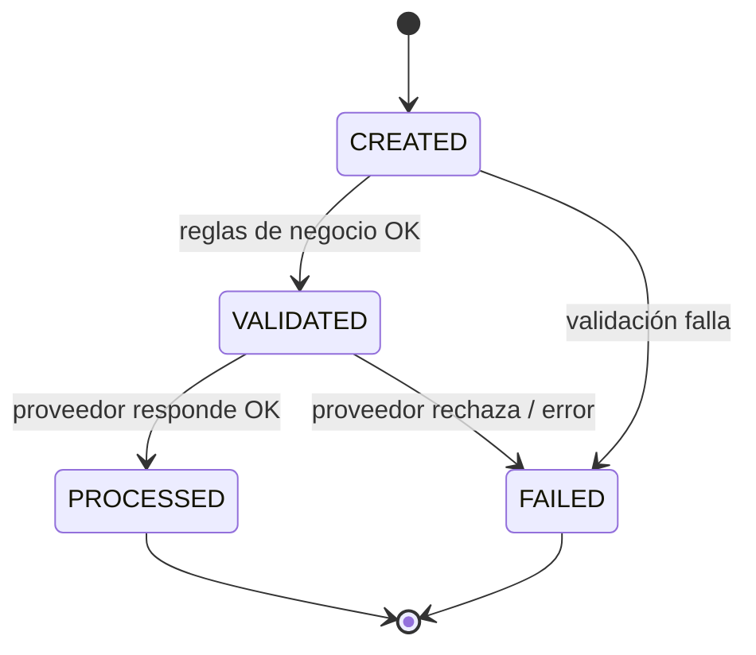

# Diagrama del Dominio

Entidades, Value Objects y máquina de estados. `PayIn` es la raíz del agregado.

## Máquina de estados

**Notas:**
- `FAILED` es terminal; no admite reintentos automáticos (fuera de alcance según el PRD).
- Las transiciones se validan en el dominio (ver [ADR-007](../ADR.md#adr-007---máquina-de-estados-de-payin)).
