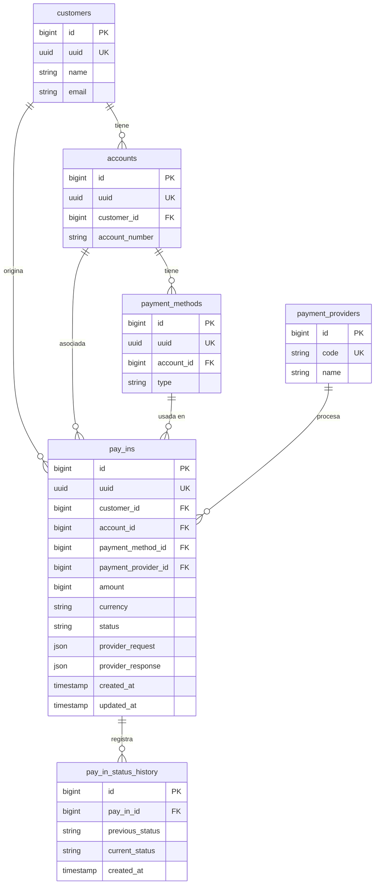

# Diagrama Entidad-Relación

Modelo relacional normalizado. `id` entero para relaciones internas; `uuid` como identificador público (ver [ADR-005](../ADR.md#adr-005---identificadores-duales-id-interno--uuid-público)).

**Notas:**
- `amount` se almacena en la unidad menor de la moneda (entero) para evitar errores de punto flotante (VO `Money`).
- `pay_ins.status` refleja el estado vigente; `pay_in_status_history` conserva la traza completa de transiciones.
