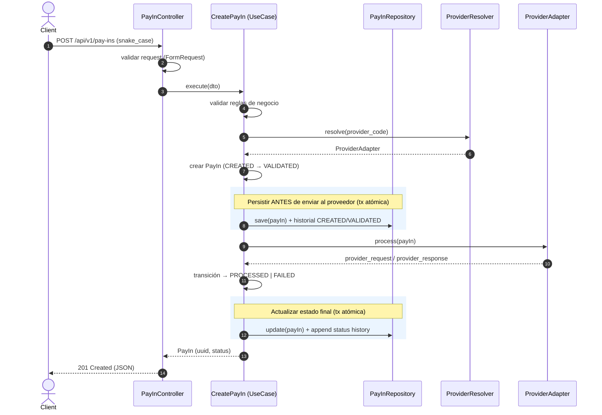

# Diagrama de Secuencia — Crear PayIn

Flujo del caso de uso `CreatePayIn` (`POST /api/v1/pay-ins`).

**Notas:**
- La validación de formato ocurre en el `FormRequest`; las reglas de negocio, en el dominio.
- **El orquestador persiste el PayIn (CREATED/VALIDATED) antes de enviar la transacción al proveedor.** Cada escritura es atómica (ver [ADR-009](../ADR.md#adr-009---operaciones-transaccionales)); la llamada al proveedor queda **fuera** de la transacción.
- Un fallo del proveedor lleva la transacción a `FAILED`, registrando igualmente `provider_response` y el historial.
